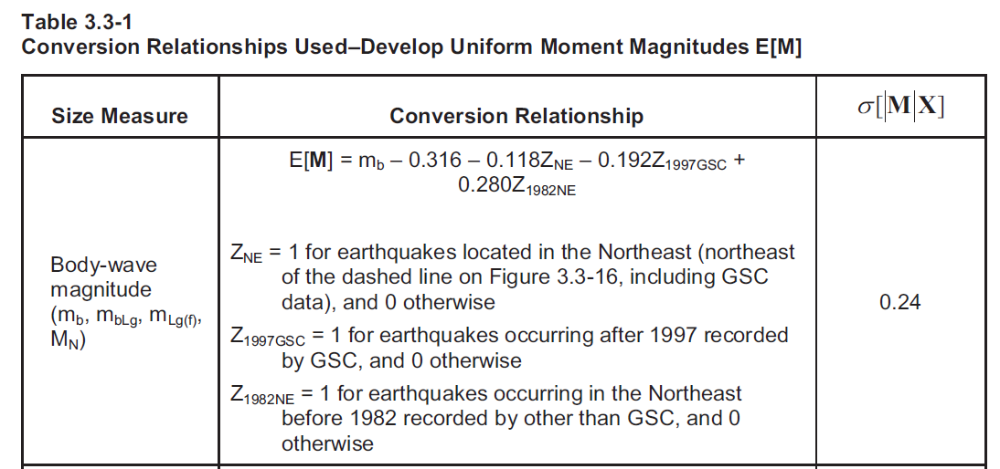

## intraplate-seismicity
An exploration of intraplate seismicity in the northeast USA.

####Catalog sources:
 - HM_2014 (flle: 2014_NEIC_declustered.c4; includes historic and event until 2012)
 - ANSS_2013 (file: anss; includes all mag events 2013 until jun 30, 2015)
 - Small_mag (file: small_mag_ISC_75_2012; includes events from 1975 to 2012 with mag < 2.5 or no magnitude determined)

####Magnitude Conversions:

Magnitude conversions where requred on data from ANSS_2013.  This was the methodology used.
 

*Where the "dashed line" is the function:* `f(lat) = -0.45*lon + 3`
 
####Filtering Parameters Used:
 - Todo
 
####Installation:
 - Download and install R
 - Download and install RStudio
 - If mac:  download and install XQuartz

####Execution:
 - Run the entire import.r script.  Select all, then press ctrl-enter.  R may ask you to install packages: press yes.
 - Click Run App in the ui.r file.
 
 
####Troubleshooting:

#####Error: There is no package called ShinyRGL.
This error is indicative that XQuartz is not installed on mac.  If you just installed it, restart your R session.  You should not recieve this error on PC.
